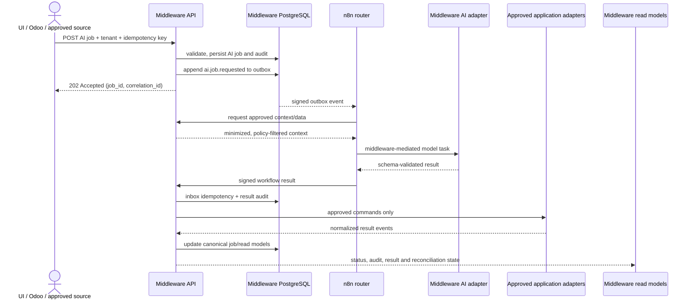

# Codestra AI → n8n → application data flow

This is the canonical boundary for AI-assisted automation. It extends the
existing signed event, durable outbox, workflow inbox, command journal, and
reconciliation architecture. It is intentionally asynchronous and
at-least-once.



## Ownership

### Middleware owns

* Authentication, authorization, tenant and campaign scope.
* AI job identity, state, idempotency, expiry and audit history.
* Prompt/input minimization and output-schema policy.
* Provider credentials and model routing through the AI adapter.
* n8n delivery leases, retries, dead letters and workflow-result inbox.
* Commands to Odoo, VICIdial, Postly and other approved adapters.
* Canonical status and reconciliation.

### n8n owns

* Workflow routing and non-authoritative transformations.
* Gathering context by calling middleware query APIs.
* Selecting an approved AI task policy (never a secret or arbitrary URL).
* Calling the middleware AI task endpoint.
* Returning a signed, schema-validated workflow result.
* Non-critical notifications and reporting workflows.

n8n is not a system of record and never calls provider databases, VICIdial,
Postly, Odoo, Qwen, or LiteLLM directly. The middleware may use LiteLLM/Qwen
behind its provider adapter; n8n sees only task IDs and normalized results.

## Canonical state flow

```text
RECEIVED
  → VALIDATED
  → POLICY_ALLOWED
  → OUTBOX_PENDING
  → DISPATCH_RESERVED
  → DISPATCHED
  → N8N_ACKNOWLEDGED
  → RESULT_RECEIVED
  → RESULT_VALIDATED
  → APPLICATION_ACTION_PENDING
  → COMPLETED
```

Safe terminal alternatives are `POLICY_DENIED`, `CONSENT_BLOCKED`,
`DNC_BLOCKED`, `QUARANTINED`, and `FAILED_TERMINAL`. Temporary failures return
to `RETRY_PENDING`; uncertain provider writes become `UNKNOWN`/reconciliation
required and are never blindly retried.

## Message contracts

Every request, event, and result carries:

```text
message_id
event_id or job_id
command_id when an application action exists
tenant_id / business_unit / campaign_id
correlation_id
causation_id
schema_version
idempotency_key
occurred_at / expires_at
environment
```

AI requests additionally carry:

```text
task_type
model_policy_id
minimized_input
output_schema
human_review_required
```

They must not carry passwords, API keys, payment data, unrestricted customer
profiles, or raw provider credentials. Results include the model policy,
provider classification, normalized output, confidence, warnings, and whether
human review is required.

## Side-effect policy

| Result class | Default handling |
| --- | --- |
| Analysis, classification, summary | Store as derived result; no external write |
| Odoo internal activity or reporting update | Middleware allowlist; idempotent command |
| VICIdial lead/callback/call action | Consent, campaign, calling-hours, kill-switch and command policy checks |
| Postly draft | Middleware validation; approval record required before schedule |
| Postly publish, message, payment, external call | Disabled by default; separate production authorization |

AI output is advisory unless a policy explicitly allows a specific normalized
action. Raw model text never becomes an executable command.

## Reliability and isolation

* PostgreSQL is the initial durable queue and source of truth; Redis is not a
  required dependency for correctness.
* Workers claim rows with `FOR UPDATE SKIP LOCKED`, bounded concurrency, and
  per-tenant fairness.
* Delivery is at-least-once with idempotent consumers, not exactly-once.
* Temporary, permanent, and ambiguous failures are classified separately.
* Circuit breakers defer new provider work when health/error thresholds are
  exceeded.
* Recent, daily, and deep reconciliation compare command state with provider
  readback and create drift records without rewriting history.
* Audit and security-rejection records are append-only and redacted.

## Safe defaults

```text
ENABLE_AI_PROVIDERS=false
lead_automation_enabled=false
n8n_lead_binding_enabled=false
n8n_result_processing_enabled=false
odoo_lead_apply_enabled=false
vicidial_write_enabled=false
live_writes_enabled=false
enable_external_delivery=false
production_n8n_enabled=false
```

The global safety validation rejects unsafe combinations at startup. Synthetic
fixtures may exercise the full flow without contacting a real AI provider or
application.

## Implementation mapping in this repository

* `POST /api/v1/ai/jobs` — persists a tenant-scoped AI job and appends
  `ai.job.requested` to the transactional outbox; duplicate idempotency keys
  replay the original job.
* `GET /api/v1/ai/jobs/{job_id}` — tenant-scoped job query.
* `POST /api/v1/ai/jobs/{job_id}/cancel` — cancel before a terminal result.
* `POST /api/v1/ai/jobs/{job_id}/result` — HMAC-authenticated workflow-result
  ingestion with timestamp, nonce replay protection, and duplicate-result
  suppression.
* `migrations/versions/0032_ai_platform_foundation.py` — durable AI jobs,
  event history, and attempt history.
* `app/core/ai_services.py` — versioned AI request/result models, minimization,
  deterministic policy and redaction.
* `app/core/lead_automation.py` — durable-style state machine, tenant scope,
  idempotency, n8n result validation and Odoo action gating.
* `app/api/v1/lead_automation.py` — signed Odoo event and n8n result ingress.
* `app/adapters/n8n/transport.py` — attested, leased n8n delivery.
* `app/workers/outbox.py` / `app/workers/delivery.py` — queue leases, retry,
  dead-letter and ordering primitives.
* `app/workers/telephony_commands.py` — policy-revalidated application command
  dispatcher and ambiguous-write readback.

Authenticated AI/provider execution remains separately gated by owner-provided
credentials, endpoints, and staging approval.
