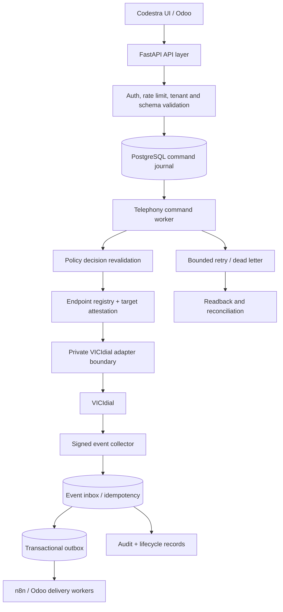

# Codestra middleware command/event architecture

This document maps the command/event topology to the implemented components.
The middleware remains the system of record and the only policy authority. The
external VICIdial adapter and n8n/Odoo transports are fail-closed by default;
the synthetic path is executable without provider credentials.

## Implemented boundaries

| Topology component | Implementation | Safety boundary |
| --- | --- | --- |
| Command API | `app/api/v1/commands.py`, `app/core/telephony_commands.py` | Versioned request, policy decision, idempotency, public IDs only |
| Command store | `telephony_command_journal` | PostgreSQL transaction and unique idempotency hash |
| Dispatcher | `app/workers/telephony_commands.py` | `FOR UPDATE SKIP LOCKED`, lease owner, bounded retry, readback |
| Adapter client | `app/adapters/telephony/client.py` | Registry-resolved private route, mTLS/attestation, no arbitrary URLs |
| Adapter runtime | `app/entrypoints/vicidial_adapter.py` | Disabled unless the provisioning gate is explicitly enabled |
| Event collector ingress | `POST /api/v1/events/vicidial` | HMAC, timestamp, nonce, client allowlist, schema and replay checks |
| Workflow inbox | `event_inbox` / `integration_event` | Atomic idempotency and duplicate response replay |
| Event outbox | `outbox_event` and `integration_delivery` | Durable leases, retry, dead letter, replay and ordering checks |
| Reconciliation | `app/workers/reconciliation.py` and telephony readback | Drift is reported; historical records are not rewritten |
| Audit | `AuditEvent` and telephony journal records | Redacted, correlation-bound history |

## Current safe runtime

The code and tests exercise only synthetic/test-scoped records. External
VICIdial writes, live dialing, broad n8n delivery, Odoo writes, and production
workflow activation remain disabled. A provider credential or adapter endpoint
must not be inferred from this document; it must be supplied through the
approved server-side secret and endpoint registry mechanisms.

The architecture therefore supports the requested production shape without
opening a direct n8n-to-VICIdial, n8n-to-database, or browser-to-provider path.
