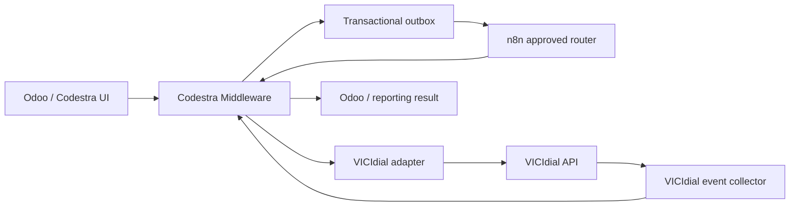

# Codestra Middleware ↔ n8n ↔ VICIdial

The middleware is the system of record and policy boundary. Business events are persisted before delivery through the durable outbox. n8n receives only approved, authenticated middleware deliveries and submits result acknowledgements back to middleware. VICIdial access is confined to the middleware adapter boundary.

External dialing, messaging, callback dispatch, production writes, campaign mutation, and payment execution remain disabled by default.
