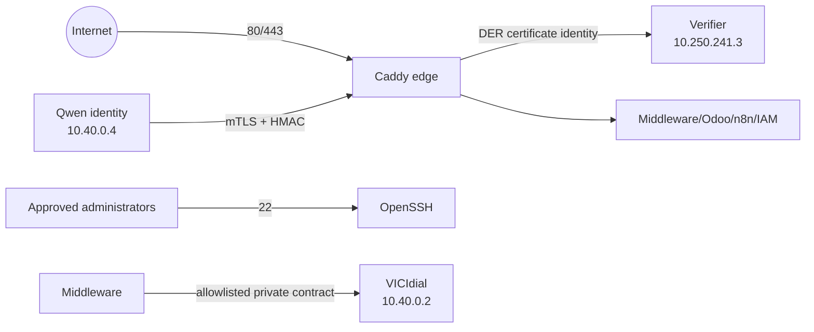

# Network Security and Trust Boundaries

UFW is active with default deny incoming and routed traffic. Only 22/tcp,
80/tcp, and 443/tcp are allowed publicly for IPv4 and IPv6. Qwen access is
source-bound to 10.40.0.4, requires client-certificate verification, and Caddy
replaces client-supplied certificate identity with authenticated TLS DER.
VICIdial callbacks are source-bound to 10.40.0.2. The verifier publishes no
host port and is reachable only from Caddy on its dedicated bridge.

Fail-closed findings:

1. VICIdial private connectivity is unavailable, so its private trust contract
   cannot currently be certified.
2. Reverse-direction tests cannot be certified without execution by each
   remote zone's local Codex session.
3. Bandwidth is not measured because no authorized private iperf endpoint is
   running; opening one was outside a read-only validation.
