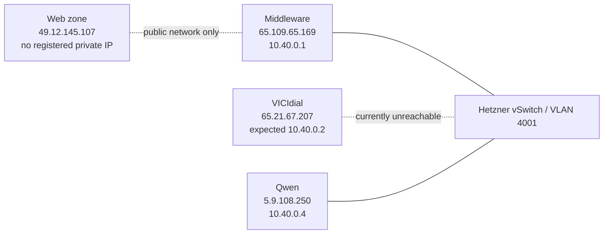
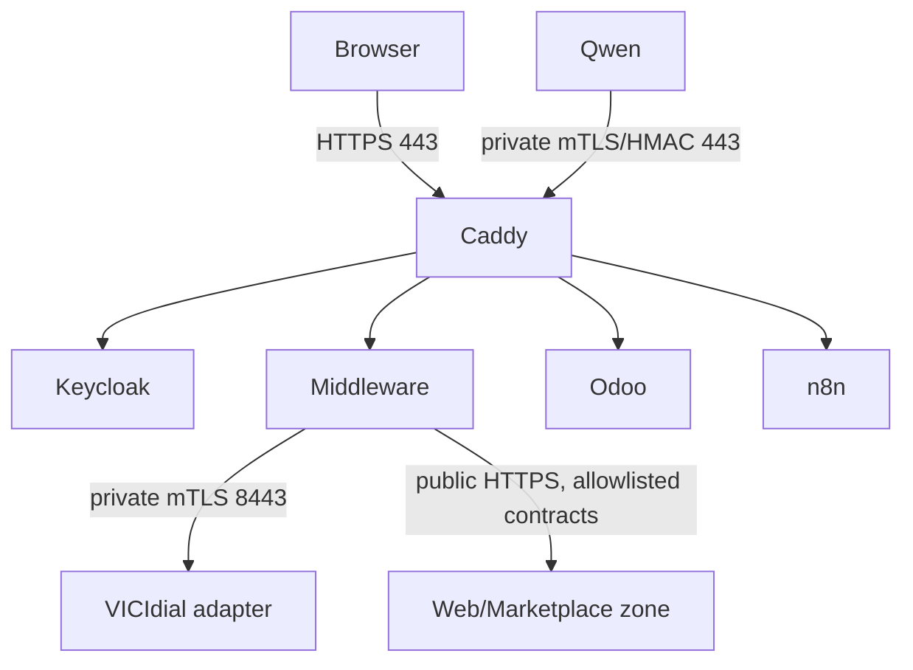

# Codestra Network Topology

## Physical and VLAN view

## Logical service dependencies

No overlay network is configured. Docker networks are local bridges. The
private verifier network is `codestra_qwen_auth_private` (10.250.241.0/29):
Caddy is 10.250.241.2 and the verifier is 10.250.241.3. Telephony provisioning
uses `codestra-provisioning-service_telephony_private` (10.250.240.0/28).
